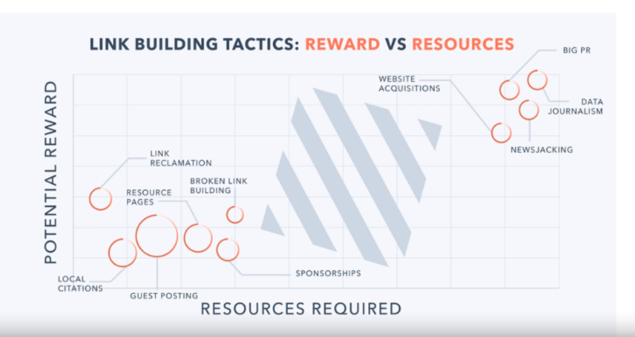

## Art of link building
- Link building is about carefully and tactfully building meaningful relationships with the right people who can and want to link to your website. 

## Link building tactics

## Scaling
- The only way to scale low-risk, low-reward link building tactics is by building lasting relationships

## Deliver value to people when starting a relationship
- E.g. Reach out to a known blog site and offer to write a guest post.

## How are you currently doing relationship building?
- What relationships does your organization already have with journalists, bloggers, influencers, and others who might link to your site. 
- Whom do you with your organization had a relationship with?
- What value can you offer them to initiate a relationship. 

